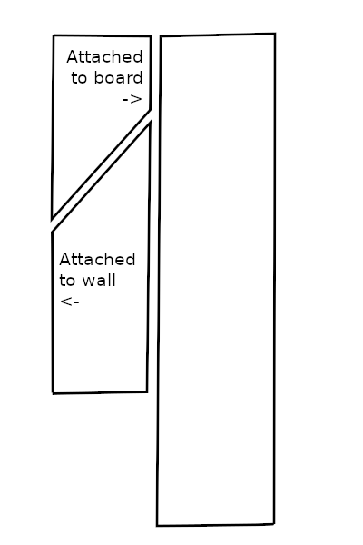

# StrangerIoThings
An ESP8266 + neopixel based prop.

I made this to use as a live background for video calls with friends and social gatherings.

# Construction

## The circuit

### Bill of Materials

1. ESP8266 Huzzah (x1) https://www.adafruit.com/product/2471
2. WS2811 12mm Diffused Digital RGB LED Pixel Light (x2) https://www.amazon.com/gp/product/B01AG923GI
3. 5 volt power supply https://www.amazon.com/gp/product/B078RXZM4C
4. terminal blocks
5. 220 ohm resistor
6. capacitor

The connections are described below:

* ESP pin 14 -> 220 ohm resistor -> data pin on led string
* Capacitor in parallel with led string + and - (not required)
* LED + to 5v power supply
* LED - to GND
* ESP8266 VBATT to 5v power supply
* ESP8266 gnd to ground

### Assembly

Wire the breadboard as indicated above.
The capacitor is optional, but will smooth out voltage drops when a lot of led's turn on at once.

## The rest

I made this out of 4' x 4' x 5/8" plywood.
I decided I wanted to use a french cleat system so I could easily hang/remove the board from my wall.
First I ripped about a 6" section off one edge.
Of that, I ripped it into a 4" piece and a 2" piece.
The 4" piece was ripped again, with the blade set at a 45 degree angle.

One piece is attached to the plywood sheet, the other to the wall.
The angled pieces are oriented so gravity pulls the plywood closer to the wall.

The remaining strip is attached to the bottom edge of the plywood to keep it parallel with the wall.

To support the lights, I used some panel nails.
Finally, I painted the letters.
The letters has a light between them for separation.
The lights zig-zag across, so the number mapping is not sequential.

# Operation

There are a few pre-programmed modes.
Every 10 minutes it will choose a pre-defined phrase to spell, similar to what is seen in the series.
After one of these messages, it enters a cooldown period, where all the LEDs are off.
After a further cooldown, the LED's will chase and then wait to spell another message.

Additionally, opening a web browser and opening the ip address, there are options to send arbitrary text to spell, as well as indicating yes or no.
